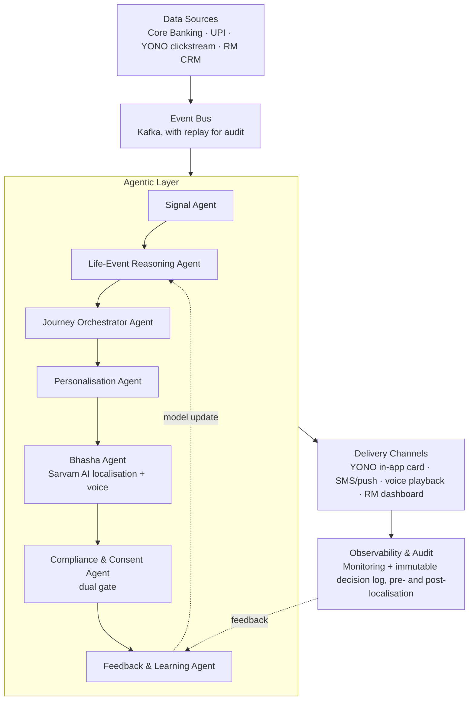

# Drishti — Agentic AI for Proactive, Every-Language Banking Engagement

**SBI Hackathon @ GFF 2026 · Problem Statement Focus: Digital Engagement**

> Banking that sees you coming — and speaks your language.

Drishti (Sanskrit: *insight / foresight*) is an agentic AI engagement layer that reads life-event and behavioural signals across SBI's existing digital ecosystem — core banking transactions, UPI activity, and YONO app usage — and proactively orchestrates the right banking action, in the customer's own language and voice, through the right channel.

It is not a chatbot and not a RAG assistant. It is a proactive decision-and-orchestration system: a closed loop of specialised agents that perceive a signal, reason about what it means, localise the response into the customer's own language, act, and learn from the outcome.

---

## Table of Contents

- [Problem](#problem)
- [Solution Overview](#solution-overview)
- [The Agentic Loop](#the-agentic-loop)
- [Reaching Every Language](#reaching-every-language)
- [Agents](#agents)
- [Example Scenario](#example-scenario)
- [Architecture](#architecture)
- [Process Flow](#process-flow)
- [Technology Stack](#technology-stack)
- [Repository Structure](#repository-structure)
- [Getting Started](#getting-started)
- [Compliance & Responsible AI](#compliance--responsible-ai)
- [Roadmap](#roadmap)
- [Business Model](#business-model)
- [Team](#team)
- [License / IP](#license--ip)

---

## Problem

- **Customers act, banks find out later.** A first salary, a home purchase, a new business — these moments happen off-platform. SBI typically learns about them only when the customer walks in, or after a competitor already has.
- **The signals already exist, unused.** Transaction flows, UPI patterns, and YONO usage reveal these moments in real time, but nothing today reasons about them autonomously or acts on them.
- **Even a good offer can fail to land.** A perfectly-timed nudge in English text is still invisible to a customer who reads Bengali, speaks Kannada at home, or simply prefers to listen rather than read. Most digital banking tools quietly assume an English- or Hindi-literate, smartphone-fluent customer — excluding exactly the population financial inclusion is meant to reach.

## Solution Overview

Drishti continuously perceives behavioural and life-event signals, reasons about the single best next action, localises that action into the customer's own language and voice, acts through the right channel, and learns from what happens.

Every autonomous action is gated by consent and compliance checks — **twice**: once before any content is drafted, and again after localisation, since translation can shift emphasis or meaning. A human relationship manager (RM) stays in the loop for regulated or high-value decisions.

## The Agentic Loop

| Stage | What happens |
|---|---|
| **Perceive** | Streams transaction, UPI, and YONO signals; detects behaviour and life-event markers in real time. |
| **Reason** | Classifies the life-event hypothesis and picks the single best next action, with a confidence score. |
| **Localise** | Renders the message and voice in the customer's own language and script before it ever reaches them. |
| **Act & Learn** | Delivers through the right channel, tracks the outcome, and sharpens future decisions. |

## Reaching Every Language

India's constitution recognises 22 scheduled languages. A digital banking product that only speaks English or Hindi quietly excludes a large share of exactly the customers financial inclusion policy is meant to reach — rural households, senior citizens, and first-generation digital users.

The **Bhasha Agent**, powered by **Sarvam AI's** Indian-language and speech models, closes this gap:

- **Localises every message** — the canonical nudge is translated into the customer's preferred language and script, not a fixed template.
- **Speaks and listens** — a voice version is generated via text-to-speech for low-literacy and senior-citizen customers; spoken replies are transcribed back via speech-to-text.
- **Scoped, not open-ended** — customers can ask about that specific nudge in their own language; Drishti stays a proactive agent first, not a general-purpose chatbot.
- **Checked twice, not once** — because translation can shift emphasis, the Compliance Agent re-checks the localised message itself, after translation, not just the English draft.

## Agents

| Agent | Responsibility |
|---|---|
| **Signal Agent** | Streams core-banking, UPI, and YONO events; flags behaviour and life-event markers using a rules + lightweight-ML layer. |
| **Life-Event Reasoning Agent** | Turns raw markers into a ranked life-event hypothesis (home purchase, new job, business growth) with a confidence score, grounded on a customer knowledge graph. |
| **Journey Orchestrator Agent** | Chooses the single best next action and timing per customer, applying business rules and product-eligibility policy. |
| **Personalisation Agent** | Drafts the canonical, language-agnostic message and offer content. |
| **Bhasha Agent** | Localises the message into the customer's language and script, and generates a voice version via Sarvam AI's Indian-language and speech models. |
| **Compliance & Consent Agent** | Gates the pipeline twice — consent and eligibility upfront, and the final localised message before delivery; escalates high-value or regulated actions to a human RM. |
| **Feedback & Learning Agent** | Logs outcomes, including transcribed voice replies, and retrains the signal-to-action mapping on a schedule. |

## Example Scenario

*(Illustrative — not real customer data)*

Ravi's salary jumps 40% in one month. Three months later, recurring debits begin matching a home-loan EMI paid to another bank. The Life-Event Reasoning Agent flags a high-confidence hypothesis: recent home purchase, EMI currently held with a competitor. The Bhasha Agent drafts the offer in Marathi — Ravi's saved language preference — with a short voice version attached. A YONO in-app card offers a home-loan balance transfer at a preferential rate, timed just after his EMI clears, in Marathi. Ravi opens the card and requests a callback, in Marathi; the RM is notified, and the outcome is logged to sharpen future decisions.

The same engine reaches every kind of customer:
- Retiree in rural Odisha, low literacy → voice-only nudge in Odia, no reading required
- Small trader + rising UPI inflow → working-capital overdraft nudge in Tamil
- New graduate + first salary → starter SIP investment nudge in English
- Senior citizen + pension credit → FD-ladder offer delivered as a spoken Kannada message

## Architecture



The agentic layer is grounded on a **knowledge graph** (customer–product–life-event relationships) and a **vector store** for retrieval over SBI's own product and policy catalogue, so recommendations and translations stay tied to what SBI actually offers rather than free-floating model guesses.

## Process Flow

1. **Signal Ingestion** — Core banking, UPI, and YONO clickstream events stream into the event bus.
2. **Life-Event Detection** — The Signal Agent flags behavioural/life-event markers in real time.
3. **Confidence Scoring** — The Life-Event Reasoning Agent classifies the likely event with a confidence score.
4. **Consent & Eligibility Gate** — The Compliance & Consent Agent confirms consent and product eligibility *before* any content is generated.
5. **Content Drafting** — The Personalisation Agent drafts a canonical, language-agnostic message and offer.
6. **Localisation & Voice** — The Bhasha Agent translates the message into the customer's language and script, and generates a voice version.
7. **Final Compliance Check** — The Compliance & Consent Agent re-checks the *localised* message itself, since translation can shift emphasis.
8. **Channel Delivery** — Delivered via YONO in-app card, SMS/push, voice playback, or an RM dashboard alert.
9. **Scoped Follow-Up** — If the customer asks about the nudge, by typing or speaking, the Bhasha Agent answers — grounded in the same knowledge base, strictly limited to that nudge.
10. **Feedback Loop** — Outcomes, including transcribed voice replies, feed back into the behaviour model and are written to an immutable audit trail.

> **Why two gates, not one:** a translation can occasionally shift emphasis or implied meaning. Checking only the English draft would miss that — so compliance reviews the words the customer will actually see or hear, in their own language.

## Technology Stack

| Layer | Choice | Why |
|---|---|---|
| Event Streaming | Apache Kafka | Handles real-time transaction/UPI volume; replay enables audit. |
| Knowledge Graph | Neo4j (AuraDB) | Models customer–product–life-event relationships for grounded reasoning; the team has already shipped a production Neo4j platform (DepGraph). |
| LLM, Reasoning & Voice | Provider-agnostic layer (e.g., Sarvam AI) | Common interface for tool-use/function calling. Sarvam AI's Indian-language and speech models power localisation, text-to-speech, and speech-to-text for the Bhasha Agent. |
| Vector Store / RAG | pgvector / Weaviate | Grounds nudges in SBI's actual product and policy catalogue. |
| Backend | Node.js / Python microservices + API Gateway | Independently scalable per agent; standard bank-integration pattern. |
| Frontend Prototype | React | Customer nudge simulation + RM decision dashboard, with voice playback. |
| Auth & Identity | OAuth2 / OIDC | Designed to sit behind SBI's existing YONO SSO. |
| Monitoring | Prometheus + Grafana | Real-time visibility into agent decisions and latency. |
| CI/CD | GitHub Actions | Automated build, test, and deploy for the prototype. |

## Repository Structure

```
drishti-agentic-engagement/
├── agents/
│   ├── signal-agent/
│   ├── life-event-reasoning-agent/
│   ├── journey-orchestrator-agent/
│   ├── personalisation-agent/
│   ├── bhasha-agent/               # Sarvam AI localisation + TTS/STT
│   ├── compliance-consent-agent/   # dual-gate logic
│   └── feedback-learning-agent/
├── event-bus/                # Kafka topic definitions, producers/consumers
├── knowledge-graph/           # Neo4j schema, seed data, Cypher queries
├── api-gateway/                # Request routing, auth middleware
├── frontend/
│   ├── customer-nudge-demo/    # Simulated in-app nudge experience, with voice playback
│   └── rm-dashboard/           # RM review & override console
├── infra/
│   ├── docker-compose.yml
│   └── ci/                     # GitHub Actions workflows
├── docs/
│   ├── architecture.md
│   ├── compliance.md
│   └── idea-deck.pptx
└── README.md
```

## Getting Started

> Prototype-stage repository — structure reflects the planned build for the 30-day jury-mentored phase.

```bash
# Clone
git clone https://github.com/<your-username>/drishti-agentic-engagement.git
cd drishti-agentic-engagement

# Install dependencies (per service)
npm install

# Configure environment
cp .env.example .env
# Set: LLM_API_KEY, LLM_PROVIDER, SARVAM_API_KEY, NEO4J_URI, NEO4J_USER, NEO4J_PASSWORD, KAFKA_BROKER_URL

# Run locally
docker-compose up
```

The LLM layer reads `LLM_PROVIDER` and a matching API key from environment variables, so any compatible large language model can be plugged in without code changes to the agents. `SARVAM_API_KEY` powers the Bhasha Agent's localisation and voice functions specifically.

## Compliance & Responsible AI

- **DPDP Act, 2023** — Explicit, purpose-limited consent before any behavioural inference; visible opt-out; data minimisation in the feature store.
- **RBI Guidelines** — Aligns with RBI's digital lending and outsourcing directions; regulated products (loans, insurance) always route through a human RM for final action.
- **Dual Compliance Gate** — Consent and eligibility are checked before drafting; the localised message itself is checked again after translation, since wording can shift meaning.
- **Security & Audit** — Encryption in transit and at rest; role-based access; an immutable audit log of every agent decision, pre- and post-localisation, for regulator review.
- **Human-in-the-Loop** — High-value or ambiguous cases (low confidence score, first-time product category) escalate to an RM rather than firing autonomously.

## Roadmap

1. **Hackathon Prototype** — Signal detection + orchestration demo, with localisation shown in at least two languages.
2. **30-Day Jury Build** — Working prototype with SBI mentor guidance, per the official milestone structure.
3. **Single-Circle Pilot** — Live pilot with a defined customer segment, including a rural/vernacular-first cohort.
4. **National Rollout** — Scale across SBI's customer base and language footprint; extend the engagement engine to other PSU banks.

## Business Model

Value is created for SBI first — cross-sell uplift from right-moment offers, addressable-market expansion as previously excluded language/literacy segments become reachable, higher YONO stickiness, and lower acquisition cost through existing-customer signals. The Bhasha layer itself is reusable and bank-agnostic — a standalone multilingual, voice-first accessibility layer other products could license independently of the behavioural engine. Beyond the pilot, the same engine is architected as a reusable **Engagement OS** that could extend to other public sector or regional banks.

## Team

| Name | Organization | Role |
|---|---|---|
| Rajpriyan S| Indipendent | Team Lead & Full-Stack Engineer |

## License / IP

Per the official SBI Hackathon @ GFF 2026 terms, intellectual property developed for this submission remains with the participating team. SBI may pursue future collaboration, pilot deployment, or commercialisation discussions with the team.
